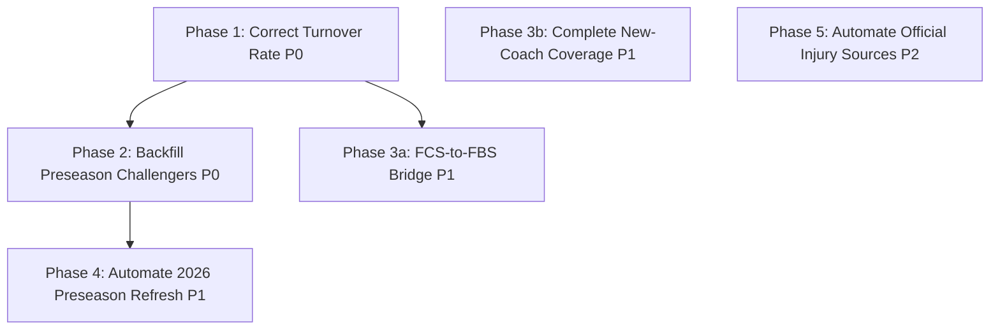

# CFB Model v2 Roadmap

This roadmap sequences the [`TODOS.md`](TODOS.md) backlog into ordered execution
phases with file-level pointers. `TODOS.md` remains the authoritative backlog and
[`cfb_v2/IMPLEMENTATION_GUIDE.md`](cfb_v2/IMPLEMENTATION_GUIDE.md) the rebuild
history; this document only answers "what do we do next, in what order, and where
in the code."

## Dependency graph



Phase 3b depends only on the existing coach identity/transition ledgers and can run
any time. Phase 5 waits on Snapshot Ledger stability, not on the other phases.

## Phase 1 — Correct Turnover Rate (P0, blocks Phases 2 and 3a)

**Problem.** `turnover_rate_regressed` is currently a shrunken copy of havoc
allowed, not a turnover rate. In
`cfb_v2/historical_data.R`, `build_team_game_efficiencies_v2()` defines havoc as
`sack | turnover | stuffed_run` (line ~719), then feeds `havoc_allowed` straight
into the regression (lines ~754-759):

```r
turnover_prior <- mean(output$havoc_allowed, na.rm = TRUE)
output$turnover_rate_regressed <- regress_unstable_rate(
  output$havoc_allowed, output$scrimmage_plays, turnover_prior, ...)
```

That duplicates a feature, overstates its apparent importance, and especially
distorts teams with missing prior FBS history.

**Work.**

1. Build a turnover-only per-play indicator from the already-extracted
   `turnover_indicator` / `turnover` fields (lines ~717-718) — excluding sacks and
   stuffed runs that did not produce a turnover.
2. Aggregate it per `game_id` × `pos_team` alongside the existing metrics and
   regress to a league turnover baseline via the existing
   `regress_unstable_rate()` helper. `havoc_allowed` stays as its own feature.
3. Rebuild the historical foundation:
   `run_cfb_v2.R --mode=build-foundation --seasons=2020:2025 --overwrite=true`.
4. Rerun the full rolling backtest: `run_cfb_v2.R --mode=backtest`.
5. Regenerate the August 29 dry run and re-check the feature-contribution labels in
   `cfb_v2/dry_run_aug29_2026.R` (both `turnover_rate_regressed_diff` and
   `havoc_allowed_diff` are reported drivers, lines ~282-283).

**Acceptance (from TODOS.md).** Raw turnover numerator uses only turnovers; rate
shrinks to a league turnover baseline; contribution reconciles to model margin;
full backtest plus the August 29 dry run are regenerated.

## Phase 2 — Backfill Preseason Challengers (P0, after Phase 1)

**Problem.** Week 0/1 has no current-season evidence, and historical misses (2025
Clemson, LSU) currently rely on hand-set adjustments instead of learned trust in
preseason information.

**Work.**

1. Pull and freeze 2021-2025 CFBD returning production, Week 1 AP/Coaches poll
   points, and 247 team-talent composites through the version-tolerant
   adapter/cache pattern in `cfb_v2/adapters.R` (cache beneath `cfb_v2/cache`).
2. Exactly one timestamped row per team-season; season-normalized numeric values,
   never raw ranks; no team/conference identity predictors; no post-kickoff data.
3. Build four rolling challengers using the existing `challenger_` prefix
   convention (excluded from production): core, +returning production, +talent,
   +poll hype gap.
4. Candidate features: `returning_ppa_pct`, `returning_passing_ppa_pct`,
   `returning_usage_pct`, `talent_percentile`, `preseason_poll_vote_share`,
   `retained_quality`, `replacement_capacity`, `hype_gap`.
5. Produce a rolling report covering Week 0/1 margin MAE, straight-up accuracy,
   ATS accuracy, calibration, and conference diagnostic slices.

## Phase 3 — Parallel P1 items (after Phase 1; 3b can start any time)

### 3a. FCS-to-FBS Bridge

Conservative prior plus added uncertainty for first-year FBS teams (North Dakota
State and Sacramento State in 2026). Treating missing FBS history as
league-average inputs produced structurally invalid August 29 projections and
extreme cover probabilities.

- Calibrate against historical FCS-to-FBS movers and FBS/FCS crossover games.
- Preserve a visible transition flag in outputs.
- Prohibit high-confidence picks when bridge uncertainty dominates.
- Backtest promoted teams as a separate slice.

### 3b. Complete New-Coach Coverage

Add prior head-coaching history for Tim Polasek, Alonzo Carter, and Tavita
Pritchard where supported, using the existing lower-level portability adjustment
(`cfb_v2/coaches.R`, `cfb_v2/coach_migration.R`) with explicit source lineage.
Their current neutral coach values weaken the mandatory coach differential in
three August 29 games.

- Canonical coach identities map as of kickoff
  (`cfb_v2/data/coach_identities.csv`, `cfb_v2/data/coach_transitions.csv`).
- Lower-level success is context-adjusted and capped; interim boundaries remain
  week-effective.
- Every assignment passes the duplicate/overlap audit
  (`cfb_v2/output/foundation/coach_assignment_qa.csv`).

## Phase 4 — Automate 2026 Preseason Refresh (P1, after Phase 2)

One rerunnable command that checks CFBD for 2026 returning production, team
talent, and preseason polls; freezes available rows; validates team coverage;
reruns the selected preseason challenger; and produces the Week 1 report.

- Missing sources fail visibly or enter a documented fallback.
- Snapshots retain source and capture time.
- Manual overrides never silently replace public data.
- Safe to rerun without changing an existing article snapshot (immutable run IDs).

## Phase 5 — Automate Official Injury Sources (P2, after Snapshot Ledger is stable)

Versioned conference, CFP, and school injury-source adapters replacing part of the
Friday manual workflow, while preserving sourced in/out scenarios.

- Begin with official conference and CFP hubs.
- Retain the manual review queue for unsupported schools.
- Never treat an unreadable report as healthy coverage.

## Standing verification (every phase)

From `cfb_v2/README.md`:

```powershell
& 'C:\Program Files\R\R-4.2.2\bin\Rscript.exe' -e `
  "testthat::test_file('cfb_v2/tests/test_v2.R', reporter='stop')"
```

plus the foundation rebuild, `--mode=backtest`, and a regenerated dry run whenever
a phase touches features, coaches, or historical data. The design contract in
`cfb_v2/README.md` is non-negotiable throughout: no team names, conference labels,
polls, lines, FPI, PFF, or public power ratings in the production model, and
challenger inputs stay behind the `challenger_` prefix.
