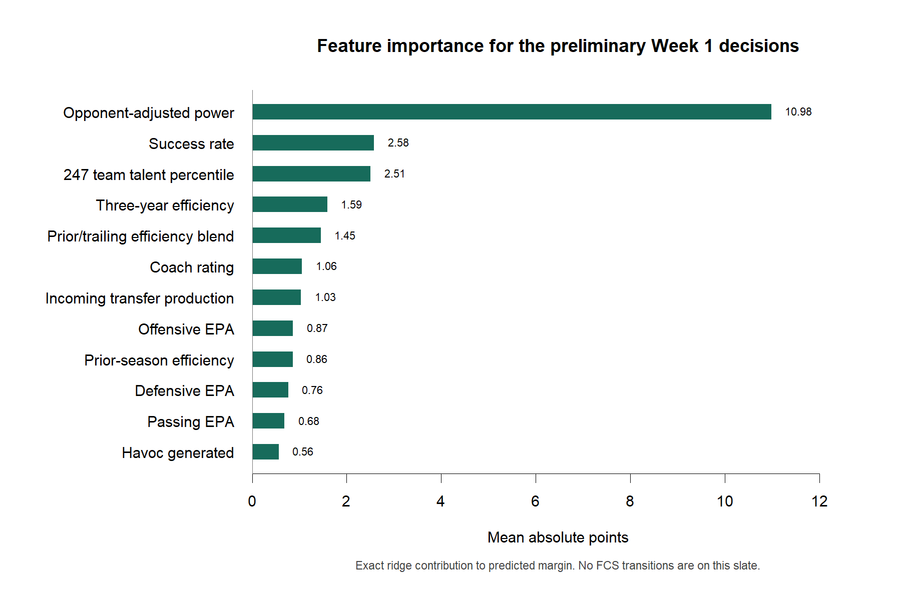

# 2026 Week 1 Preliminary Preseason Blend

Market snapshot: DraftKings via CFBD, 2026-08-30 18:04:00 UTC (`cached_cfbd`).
Selected profile: `foundation_preseason_roster_aware_blend`. The production margin starts at 80% foundation and 20% full preseason challenger. Objective incoming-transfer production can raise the challenger share to a 60% cap for major rebuilds; component estimates remain visible.
A side was requested for all 39 games; `article_pick` identifies a requested model selection that does not qualify as a validated best bet.

| Game | Market | Foundation | Returning only | Full preseason challenger | Production blend | PS share | Blend delta | SU pick | ATS pick | Edge | Pick cover | Margin SD | Data flag |
|---|---:|---:|---:|---:|---:|---:|---:|---|---:|---:|---:|---:|---|
| San Jose State at Eastern Michigan | Eastern Michigan -3.5 | Eastern Michigan -6.0 | Eastern Michigan -10.7 | Eastern Michigan -12.4 | Eastern Michigan -7.3 | 20% | +1.3 | Eastern Michigan | Eastern Michigan -3.5 | 3.8 | 50.0% | 16.3 | standard |
| UTEP at Oklahoma | Oklahoma -41.5 | Oklahoma -30.1 | Oklahoma -35.4 | Oklahoma -46.7 | Oklahoma -33.4 | 20% | +3.3 | Oklahoma | UTEP +41.5 | 8.1 | 50.0% | 18.2 | standard |
| Toledo at Michigan State | Michigan State -10.0 | Toledo -7.1 | Toledo -11.1 | Michigan State -2.4 | Toledo -5.2 | 20% | +1.9 | Toledo | Toledo +10.0 | 15.2 | 50.0% | 20.2 | new_coach_no_model_history |
| Miami at Stanford | Miami -24.5 | Miami -25.3 | Miami -26.3 | Miami -29.2 | Miami -26.3 | 26% | -1.0 | Miami | Miami -24.5 | 1.8 | 50.0% | 18.2 | roster_rebuild_review |
| Fresno State at Southern California | Southern California -23.5 | Southern California -18.1 | Southern California -20.1 | Southern California -34.3 | Southern California -21.3 | 20% | +3.2 | Southern California | Fresno State +23.5 | 2.2 | 50.0% | 18.2 | standard |
| East Carolina at Alabama | Alabama -28.5 | Alabama -10.3 | Alabama -11.6 | Alabama -18.9 | Alabama -12.0 | 20% | +1.7 | Alabama | East Carolina +28.5 | 16.5 | 50.0% | 16.3 | standard |
| Oregon State at Houston | Houston -20.5 | Houston -14.9 | Houston -18.0 | Houston -17.3 | Houston -15.4 | 20% | +0.5 | Houston | Oregon State +20.5 | 5.1 | 50.0% | 18.7 | new_coach_no_model_history |
| Coastal Carolina at West Virginia | West Virginia -21.5 | West Virginia -7.9 | West Virginia -8.1 | West Virginia -20.9 | West Virginia -10.8 | 22% | +2.8 | West Virginia | Coastal Carolina +21.5 | 10.7 | 50.0% | 16.3 | roster_rebuild_review |
| North Texas at Indiana | Indiana -40.5 | Indiana -26.8 | Indiana -28.8 | Indiana -38.6 | Indiana -30.8 | 34% | +4.0 | Indiana | North Texas +40.5 | 9.7 | 50.0% | 18.2 | roster_rebuild_review |
| Ohio at Nebraska | Nebraska -23.5 | Nebraska -5.9 | Nebraska -5.0 | Nebraska -29.5 | Nebraska -12.0 | 26% | +6.1 | Nebraska | Ohio +23.5 | 11.5 | 50.0% | 16.3 | new_coach_no_model_history |
| Liberty at James Madison | James Madison -6.5 | James Madison -18.2 | James Madison -15.5 | James Madison -7.1 | James Madison -16.0 | 20% | -2.2 | James Madison | James Madison -6.5 | 9.5 | 50.0% | 18.7 | standard |
| Miami (OH) at Pittsburgh | Pittsburgh -16.5 | Pittsburgh -8.0 | Pittsburgh -10.4 | Pittsburgh -13.1 | Pittsburgh -9.1 | 20% | +1.0 | Pittsburgh | Miami (OH) +16.5 | 7.4 | 50.0% | 16.3 | standard |
| Ball State at Ohio State | Ohio State -50.5 | Ohio State -48.9 | Ohio State -53.0 | Ohio State -64.5 | Ohio State -52.0 | 20% | +3.1 | Ohio State | Ohio State -50.5 | 1.5 | 50.0% | 18.2 | standard |
| Kent State at South Carolina | South Carolina -36.5 | South Carolina -28.1 | South Carolina -28.3 | South Carolina -49.1 | South Carolina -32.3 | 20% | +4.2 | South Carolina | Kent State +36.5 | 4.2 | 50.0% | 18.2 | standard |
| Baylor at Auburn | Auburn -7.0 | Auburn -8.5 | Auburn -4.5 | Auburn -13.4 | Auburn -10.7 | 44% | +2.2 | Auburn | Auburn -7.0 | 3.7 | 50.0% | 16.3 | roster_rebuild_review |
| Texas State at Texas | Texas -30.5 | Texas -13.8 | Texas -14.0 | Texas -29.5 | Texas -17.0 | 20% | +3.1 | Texas | Texas State +30.5 | 13.5 | 50.0% | 18.7 | standard |
| Boston College at Cincinnati | Cincinnati -7.5 | Cincinnati -11.3 | Cincinnati -9.8 | Cincinnati -12.7 | Cincinnati -11.9 | 42% | +0.6 | Cincinnati | Cincinnati -7.5 | 4.4 | 50.0% | 16.3 | roster_rebuild_review |
| Tulane at Duke | Duke -9.5 | Duke -5.5 | Duke -5.3 | Duke -15.1 | Duke -8.3 | 29% | +2.8 | Duke | Tulane +9.5 | 1.2 | 50.0% | 16.3 | roster_rebuild_review |
| Boise State at Oregon | Oregon -24.5 | Oregon -19.4 | Oregon -21.7 | Oregon -33.1 | Oregon -22.1 | 20% | +2.8 | Oregon | Boise State +24.5 | 2.4 | 50.0% | 18.2 | standard |
| Marshall at Penn State | Penn State -24.5 | Penn State -18.9 | Penn State -11.0 | Penn State -23.6 | Penn State -20.9 | 42% | +1.9 | Penn State | Marshall +24.5 | 3.6 | 50.0% | 18.7 | roster_rebuild_review |
| Oklahoma State at Tulsa | Oklahoma State -14.0 | Tulsa -5.4 | Tulsa -7.1 | Oklahoma State -6.1 | Oklahoma State -1.4 | 60% | -6.8 | Oklahoma State | Tulsa +14.0 | 12.6 | 50.0% | 19.9 | roster_rebuild_review |
| Northern Illinois at Iowa | Iowa -31.5 | Iowa -26.6 | Iowa -26.0 | Iowa -35.6 | Iowa -28.4 | 20% | +1.8 | Iowa | Northern Illinois +31.5 | 3.1 | 50.0% | 18.2 | new_coach_no_model_history |
| Wyoming at Colorado State | Colorado State -3.0 | Colorado State -2.5 | Colorado State -3.7 | Colorado State -10.0 | Colorado State -4.0 | 20% | +1.5 | Colorado State | Colorado State -3.0 | 1.0 | 50.0% | 20.2 | standard |
| Missouri State at Texas A&M | Texas A&M -41.5 | Texas A&M -23.3 | Texas A&M -26.8 | Texas A&M -46.4 | Texas A&M -27.9 | 20% | +4.6 | Texas A&M | Missouri State +41.5 | 13.6 | 50.0% | 18.2 | new_coach_no_model_history |
| Arkansas State at Memphis | Memphis -9.5 | Memphis -17.6 | Memphis -15.9 | Memphis -16.4 | Memphis -17.4 | 20% | -0.2 | Memphis | Memphis -9.5 | 7.9 | 50.0% | 18.7 | standard |
| Florida International at South Florida | South Florida -13.5 | South Florida -17.2 | South Florida -15.2 | South Florida -14.3 | South Florida -16.6 | 20% | -0.6 | South Florida | South Florida -13.5 | 3.1 | 50.0% | 18.7 | new_coach_no_model_history |
| Sam Houston at Troy | Troy -16.5 | Troy -16.6 | Troy -15.1 | Troy -13.3 | Troy -16.0 | 20% | -0.7 | Troy | Sam Houston +16.5 | 0.5 | 50.0% | 18.7 | standard |
| Clemson at LSU | LSU -10.5 | LSU -0.5 | Clemson -0.9 | LSU -8.4 | LSU -3.6 | 39% | +3.1 | LSU | Clemson +10.5 | 6.9 | 50.0% | 20.2 | roster_rebuild_review |
| UL Monroe at Mississippi State | Mississippi State -28.5 | Mississippi State -19.1 | Mississippi State -19.0 | Mississippi State -36.9 | Mississippi State -22.6 | 20% | +3.6 | Mississippi State | UL Monroe +28.5 | 5.9 | 50.0% | 18.2 | standard |
| Western Michigan at Michigan | Michigan -27.5 | Michigan -14.9 | Michigan -12.0 | Michigan -26.3 | Michigan -17.2 | 20% | +2.3 | Michigan | Western Michigan +27.5 | 10.3 | 50.0% | 18.7 | standard |
| Florida Atlantic at Florida | Florida -27.5 | Florida -16.7 | Florida -16.8 | Florida -34.7 | Florida -20.3 | 20% | +3.6 | Florida | Florida Atlantic +27.5 | 7.2 | 50.0% | 18.7 | standard |
| UNLV at Hawai'i | UNLV -3.0 | UNLV -5.6 | UNLV -0.9 | UNLV -10.4 | UNLV -6.6 | 20% | -1.0 | UNLV | UNLV -3.0 | 3.6 | 50.0% | 20.2 | standard |
| Central Michigan at New Mexico | New Mexico -10.5 | New Mexico -12.4 | New Mexico -12.0 | New Mexico -14.6 | New Mexico -12.8 | 20% | +0.4 | New Mexico | New Mexico -10.5 | 2.3 | 50.0% | 16.3 | standard |
| UCLA at California | UCLA -1.5 | California -6.0 | California -7.1 | California -3.6 | California -5.5 | 22% | -0.5 | California | California +1.5 | 7.0 | 50.0% | 20.2 | new_coach_no_model_history |
| Western Kentucky at Nevada | Western Kentucky -2.5 | Western Kentucky -8.7 | Western Kentucky -13.0 | Western Kentucky -14.2 | Western Kentucky -9.8 | 20% | -1.1 | Western Kentucky | Western Kentucky -2.5 | 7.3 | 50.0% | 16.3 | standard |
| Washington State at Washington | Washington -23.5 | Washington -10.7 | Washington -9.7 | Washington -16.0 | Washington -11.8 | 20% | +1.1 | Washington | Washington State +23.5 | 11.7 | 50.0% | 16.3 | new_coach_no_model_history |
| Louisville at Mississippi | Mississippi -6.5 | Mississippi -8.4 | Mississippi -9.0 | Mississippi -10.1 | Mississippi -8.9 | 31% | +0.5 | Mississippi | Mississippi -6.5 | 2.4 | 50.0% | 16.3 | roster_rebuild_review |
| Wisconsin at Notre Dame | Notre Dame -20.5 | Notre Dame -28.9 | Notre Dame -31.5 | Notre Dame -21.9 | Notre Dame -27.4 | 21% | -1.5 | Notre Dame | Notre Dame -20.5 | 6.9 | 50.0% | 18.2 | roster_rebuild_review |
| SMU at Florida State | SMU -3.0 | SMU -3.5 | SMU -4.3 | Florida State -0.3 | SMU -2.7 | 20% | +0.8 | SMU | Florida State +3.0 | 0.3 | 50.0% | 19.9 | standard |

## Run settings

- Foundation ridge lambda `8`; full-preseason ridge lambda `8`; coach split `65/35`; training seasons 2020-2025.
- The challenger adds CFBD returning PPA, returning passing PPA, returning usage, retained production quality, 247 talent percentile, portal depth, and source-quality-adjusted prior-year production from incoming transfers. Its Week 0/1 share is normally 20% and capped at 60% for major rebuilds; all shares phase-fade to zero in Week 5.
- Raw talent rank does not enter the model. Talent is season-normalized, and its incremental effect is shown against the returning-only challenger.
- No PFF, preseason QB tier, polls, FPI, injuries, weather, or market spread enters the margin model. Transfer ratings and prior-year transfer production are preseason challenger inputs only; the market is used by the separate ATS comparison layer.
- Every requested game receives an article ATS side. Historical ATS calibration does not clear the -110 break-even rate, so none is promoted to a validated best bet; unvalidated selections retain 50% calibrated cover probability instead of unsupported confidence.
- Market spreads above 21 points retain the model side and margin but are labeled `large_spread_review`; the cached requested-side ATS rate in that bucket is only 46.4%.
- This preliminary Week 1 run excludes the August 29 games from football features. cfbfastR has not published standardized 2026 EPA yet; direct CFBD PPA is not mixed onto the historical EPA scale. Priors use 2025 and trailing 2023-2025 FBS history.
- Neutral-site games receive zero generic home-field points; all other games use the venue listed in the CFBD schedule snapshot.
- Current head-coach mappings were resolved from `https://en.wikipedia.org/wiki/List_of_current_NCAA_Division_I_FBS_football_coaches`; ratings still use only history available before the game.

## Historical check

- Production-blend Week 0/1 rolling MAE: `14.90` across `384` held-out games; full challenger: `14.77`; returning-only: `15.56`; foundation-only: `15.30`.
- Production-blend straight-up accuracy: `84.4%`; full challenger: `83.9%`; returning-only: `82.8%`; foundation-only: `84.4%`.

## Data warnings

- Missing 2026 returning-production rows among this slate: `none`. Missing values receive the fold-trained neutral recipe value.
- Missing 2026 talent rows among this slate: `none`.
- No FCS-to-FBS transition team appears on this slate.
- Coaches without modeled prior head-coach history: `Brian Hartline, Tosh Lupoi, Mike Jacobs, JaMarcus Shephard, John Hauser, Rob Harley (interim), Casey Woods, Kirby Moore`. Their contribution is neutral rather than inferred from school brand.
- This is a preliminary market snapshot captured 2026-08-30 18:04:00 UTC; it is not the Friday article snapshot or closing market.
- The injury input is not populated for this preliminary run. Questionable high-usage players will require in/out scenarios before publication.

## Feature importance

The chart ranks variables by their mean absolute point contribution across the post-Friday-publication FBS-vs-FBS slate. The comparison removes any FCS-transition games, whose missing FBS histories distort several inputs.

## Feature drivers

- **San Jose State at Eastern Michigan:** success_rate_diff:-1.84; trailing_3yr_diff:+1.17; defense_epa_diff:+0.57; offense_epa_diff:-0.52
- **UTEP at Oklahoma:** power_rating_diff:+21.88; ps_talent_percentile_diff:+3.70; trailing_3yr_diff:-2.94; preseason_prior_diff:+2.34
- **Toledo at Michigan State:** power_rating_diff:-13.01; preseason_prior_diff:-4.44; success_rate_diff:-4.35; trailing_3yr_diff:+4.01
- **Miami at Stanford:** power_rating_diff:-27.65; success_rate_diff:-7.20; trailing_3yr_diff:+4.47; preseason_prior_diff:-3.09
- **Fresno State at Southern California:** power_rating_diff:+11.30; success_rate_diff:+4.53; ps_talent_percentile_diff:+3.43; offense_epa_diff:-2.84
- **East Carolina at Alabama:** power_rating_diff:+9.20; success_rate_diff:-4.65; ps_talent_percentile_diff:+3.43; trailing_3yr_diff:-1.89
- **Oregon State at Houston:** power_rating_diff:+9.27; preseason_prior_diff:+0.77; havoc_generated_diff:-0.75; ps_talent_percentile_diff:+0.75
- **Coastal Carolina at West Virginia:** success_rate_diff:-3.61; ps_talent_percentile_diff:+2.63; power_rating_diff:+2.58; offense_epa_diff:+0.86
- **North Texas at Indiana:** power_rating_diff:+16.50; ps_talent_percentile_diff:+4.15; success_rate_diff:-3.00; coach_rating_diff:+2.84
- **Ohio at Nebraska:** ps_talent_percentile_diff:+6.02; success_rate_diff:-1.34; trailing_3yr_diff:+1.34; ps_portal_offense_replacement_diff:+0.93
- **Liberty at James Madison:** power_rating_diff:+14.61; preseason_prior_diff:+2.26; success_rate_diff:-1.81; defense_epa_diff:-1.64
- **Miami (OH) at Pittsburgh:** power_rating_diff:+3.74; success_rate_diff:-2.67; ps_talent_percentile_diff:+0.89; prior_season_diff:-0.75
- **Ball State at Ohio State:** power_rating_diff:+39.37; success_rate_diff:+6.99; preseason_prior_diff:+6.37; trailing_3yr_diff:-6.36
- **Kent State at South Carolina:** power_rating_diff:+22.72; ps_talent_percentile_diff:+5.05; trailing_3yr_diff:-3.38; preseason_prior_diff:+1.96
- **Baylor at Auburn:** power_rating_diff:+4.50; ps_portal_offense_replacement_diff:+3.93; success_rate_diff:-3.04; home_field_points:-2.89
- **Texas State at Texas:** power_rating_diff:+10.91; success_rate_diff:-5.11; ps_talent_percentile_diff:+3.48; trailing_3yr_diff:-1.59
- **Boston College at Cincinnati:** power_rating_diff:+6.40; ps_portal_offense_replacement_diff:+2.79; offense_epa_diff:-1.53; rush_epa_diff:-1.18
- **Tulane at Duke:** success_rate_diff:-2.71; ps_portal_offense_replacement_diff:+2.58; coach_rating_diff:+2.57; power_rating_diff:-2.56
- **Boise State at Oregon:** power_rating_diff:+12.16; ps_talent_percentile_diff:+3.08; trailing_3yr_diff:-1.58; preseason_prior_diff:+1.26
- **Marshall at Penn State:** power_rating_diff:+13.63; ps_talent_percentile_diff:+6.41; ps_portal_offense_replacement_diff:+3.65; trailing_3yr_diff:-2.65
- **Oklahoma State at Tulsa:** ps_portal_offense_replacement_diff:-7.28; ps_talent_percentile_diff:-2.83; coach_rating_diff:-1.53; ps_portal_replacement_capacity_diff:+1.33
- **Northern Illinois at Iowa:** power_rating_diff:+17.99; ps_talent_percentile_diff:+3.57; preseason_prior_diff:+2.14; success_rate_diff:+1.79
- **Wyoming at Colorado State:** power_rating_diff:-3.34; ps_talent_percentile_diff:+2.23; success_rate_diff:-1.70; defense_epa_diff:+1.53
- **Missouri State at Texas A&M:** power_rating_diff:+16.89; ps_talent_percentile_diff:+4.91; preseason_prior_diff:+2.63; trailing_3yr_diff:-2.19
- **Arkansas State at Memphis:** power_rating_diff:+13.95; trailing_3yr_diff:-2.17; preseason_prior_diff:+1.77; offense_epa_diff:-1.36
- **Florida International at South Florida:** power_rating_diff:+12.27; preseason_prior_diff:+1.77; ps_talent_percentile_diff:+1.60; pass_epa_diff:-1.39
- **Sam Houston at Troy:** power_rating_diff:+10.97; success_rate_diff:-2.36; coach_rating_diff:+1.73; preseason_prior_diff:+1.59
- **Clemson at LSU:** success_rate_diff:-5.44; ps_portal_offense_replacement_diff:+3.89; power_rating_diff:-2.61; offense_epa_diff:+0.97
- **UL Monroe at Mississippi State:** power_rating_diff:+13.14; ps_talent_percentile_diff:+4.91; havoc_generated_diff:-1.17; preseason_prior_diff:+1.10
- **Western Michigan at Michigan:** power_rating_diff:+11.35; ps_talent_percentile_diff:+4.24; trailing_3yr_diff:-2.71; preseason_prior_diff:+1.57
- **Florida Atlantic at Florida:** power_rating_diff:+9.33; ps_talent_percentile_diff:+3.84; coach_rating_diff:+2.12; success_rate_diff:-1.91
- **UNLV at Hawai'i:** power_rating_diff:-8.90; success_rate_diff:-5.88; ps_talent_percentile_diff:-2.74; trailing_3yr_diff:+2.35
- **Central Michigan at New Mexico:** power_rating_diff:+5.72; success_rate_diff:-1.69; coach_rating_diff:+0.70; defense_epa_diff:+0.49
- **UCLA at California:** power_rating_diff:+3.48; success_rate_diff:-2.74; coach_rating_diff:-1.63; rush_epa_diff:+0.87
- **Western Kentucky at Nevada:** power_rating_diff:-10.32; success_rate_diff:-6.50; preseason_prior_diff:-1.86; trailing_3yr_diff:+1.52
- **Washington State at Washington:** power_rating_diff:+5.23; ps_talent_percentile_diff:+2.45; preseason_prior_diff:+1.69; trailing_3yr_diff:-1.45
- **Louisville at Mississippi:** power_rating_diff:+6.15; home_field_points:-2.90; ps_portal_offense_replacement_diff:-1.52; ps_talent_percentile_diff:+1.46
- **Wisconsin at Notre Dame:** power_rating_diff:+24.14; success_rate_diff:+5.37; preseason_prior_diff:+4.46; trailing_3yr_diff:-3.93
- **SMU at Florida State:** power_rating_diff:-9.21; trailing_3yr_diff:+1.96; coach_rating_diff:-1.64; preseason_prior_diff:-1.16
